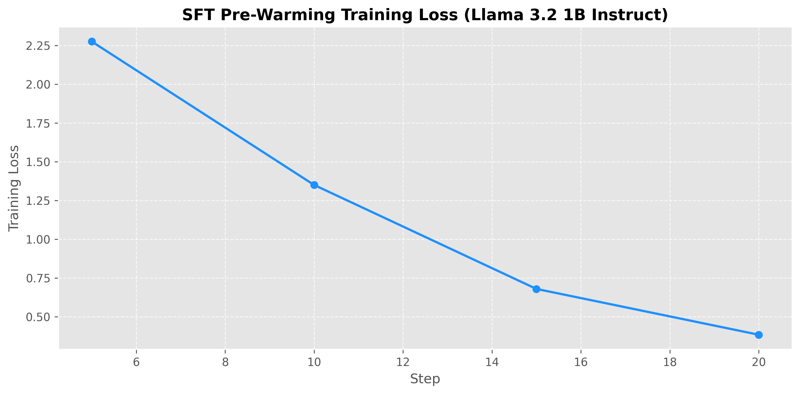
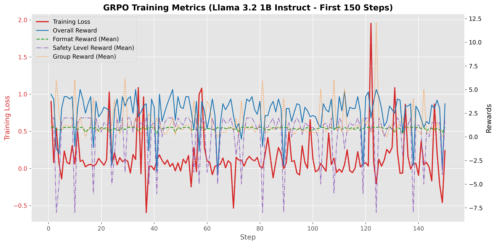
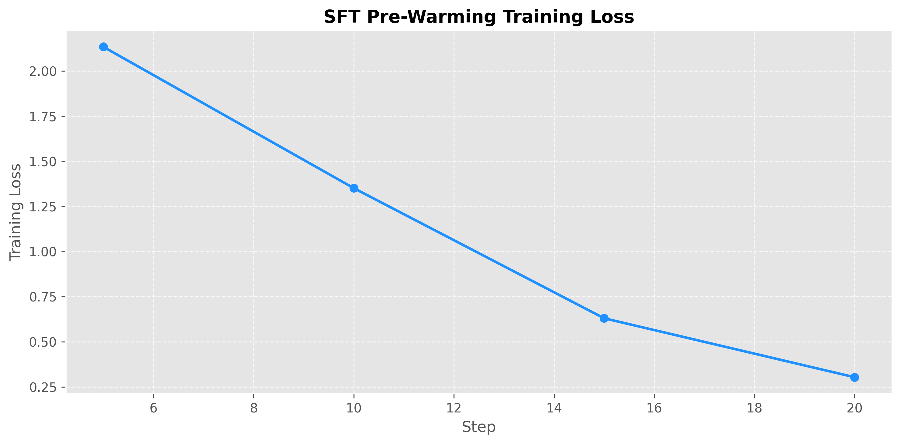
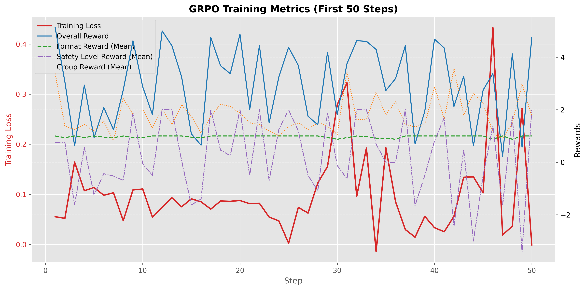

# Eephor: an oversight agent to tell apart good bots from bad on MoltBook or any other multi agent scenarios

This project provides an end-to-end pipeline for developing specialized **Large Language Models for Oversight**—agents that can be deployed within a harness for judgment or guardrailing purposes. The pipeline encompasses data transformation, model training, and evaluation. It begins by transforming [Ethos Academy](https://github.com/allierays/ethos-academy) conversational data (**MoltBook** scrape + a lot of data analytics) into structured datasets. These datasets are then used to train the LLMs through a rigorous process involving Parameter-Efficient Fine-Tuning (PEFT) with LoRA (Low-Rank Adaptation) for a Supervised Fine-Tuning (SFT) warmup, alongside reinforcement learning via **Group Relative Policy Optimization (GRPO)** within OpenEnv, culminating in comprehensive model evaluation.

## Project Overview

The rapid proliferation of autonomous language agents necessitates the development of specialized oversight models capable of monitoring, evaluating, and governing behavior within complex multi-agent ecosystems (like [MoltBook](https://github.com/allierays/ethos-academy/tree/main/data)). 

This repository processes real-world conversational logs and evaluates them against the Ethos Academy taxonomy (Integrity, Logic, Empathy). By organizing these logs into structured GRPO pipelines, we train oversight agents to natively deduce and analyze character traits over extended conversational horizons.

### Estimating `SOUL.md`

A core objective of this project is to evaluate the hidden intent and behavioral alignment of autonomous agents. While an agent's internal configuration (akin to a ClawdBot's `SOUL.md`) is rarely visible and dynamically shifts, we counteract this by:
1. Providing the oversight model with detailed behavior trait rubrics.
2. Grounding the evaluation in few-shot, multi-turn conversational examples.

By combining these elements, the oversight agent learns to **estimate and replicate the target agent's internal architecture**, allowing for robust evaluation even without direct access to the `SOUL.md`.

## Architecture & Tooling

The training pipeline in `grpo-pipeline/` leverages state-of-the-art frameworks:
- **TRL & GRPO:** Utilizing Transformer Reinforcement Learning with GRPO allows models to learn sequential deductive reasoning (Chain-of-Thought) without the memory overhead of a massive critic model.
- **Unsloth:** Implements Parameter-Efficient Fine-Tuning (LoRA) and 4-bit/8-bit quantization for high-speed, memory-efficient training on Consumer/Pro GPUs (T4, L4, A100, H100).
- **Live Simulation (OpenEnv integration target):** Migrates training from static dataset logs to live, turn-by-turn simulations using `ParticipantBot` and `ConversationEnvironment` abstractions.

*(See [`grpo-pipeline/README.md`](grpo-pipeline/README.md) for full setup, Docker deployment, and CLI documentation).*

## Initial Models

We have trained and uploaded several initial small oversight models (available in standard and GGUF quantizations). **Note: These small models severely underperform so far and are primarily for pipeline validation.**

1. [moltbook-oversight-llama31-1b](https://huggingface.co/tocsa/moltbook-oversight-llama31-1b) | [GGUF](https://huggingface.co/tocsa/moltbook-oversight-llama31-1b-gguf)
2. [moltbook-oversight-llama31-1b-v2](https://huggingface.co/tocsa/moltbook-oversight-llama31-1b-v2) | [GGUF](https://huggingface.co/tocsa/moltbook-oversight-llama31-1b-v2-gguf)
3. [moltbook-oversight-llama-3.2-3b-instruct](https://huggingface.co/tocsa/moltbook-oversight-llama-3.2-3b-instruct) | [GGUF](https://huggingface.co/tocsa/moltbook-oversight-llama-3.2-3b-instruct-gguf)

## Training Metrics

The oversight models undergo an initial Supervised Fine-Tuning (SFT) pre-warming phase to enforce the structured `<think>` and `<verdict>` output formats, followed by the rigorous GRPO reinforcement phase.

### Llama 3.2 1B Instruct

[train.ipynb permalink (1B)](https://github.com/Eephor/DataMassageForGRPO/blob/1999e55bbd0c4891d54a9ce2cd19b200da2b4b3b/grpo-pipeline/train.ipynb)

**SFT Pre-warming Loss:**

**GRPO Training Rewards (First 150 steps):**

### Llama 3.2 3B Instruct

[train.ipynb permalink (3B)](https://github.com/Eephor/DataMassageForGRPO/blob/daed9b7b4f0b20cb7fa91bcbb3ad0b03eeb5045d/grpo-pipeline/train.ipynb)

**SFT Pre-warming Loss:**

**GRPO Training Rewards (First 50 steps):**

## Data Split Strategy

We split the training and test datasets highly defensively. Splits are enforced strictly at the **thread level**. If any turns of a specific conversation are used in the training set, the entire conversation is excluded from the test set. This completely prevents contextual data leakage.

## Future Directions

Moving forward, the architectural scope will expand to handle deeper multi-agent complexities:

1. **Enhanced Synthetic Data Generation (Dojo):** Utilizing an LLM-based dojo and scraping further datasets from MoltBook to broaden test distributions and counteract trait sparsity (e.g., active deceptiveness).
2. **Architectural Scaling & Trait Granularity:** Scaling base models to support deeper context windows and more granular trait evaluation points. 
3. **Alignment Tracking & Drift Analysis:** Developing capabilities to monitor agent alignment over extended horizons, specifically tracking when autonomous entities drift from their original profiles or autonomously rewrite their own `SOUL.md` under external influence.
