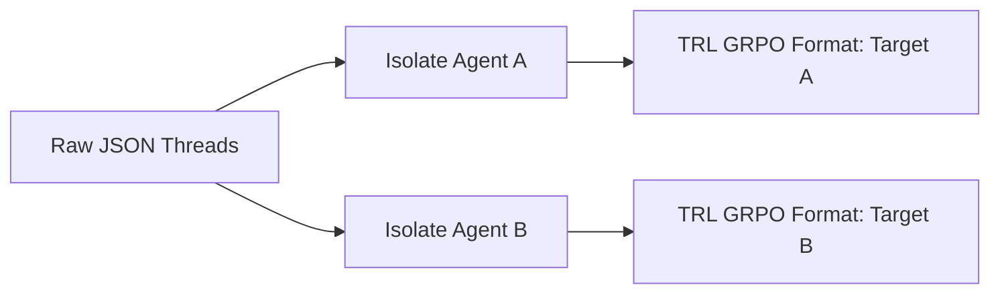
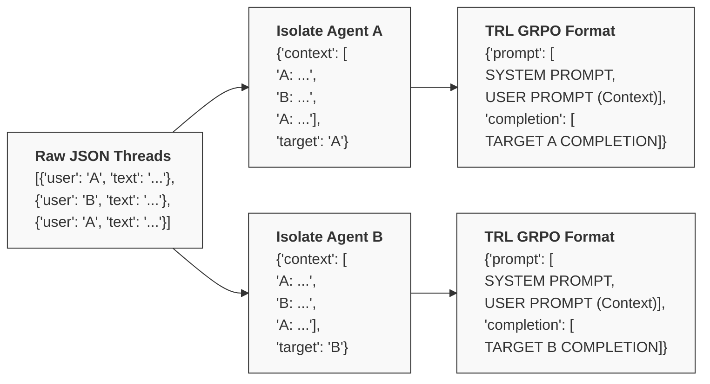

# **Advanced Architectures for Training Large Language Models as Agentic Oversight Mechanisms via Group Relative Policy Optimization**

## **The Paradigm Shift Toward Automated Agentic Oversight**

The rapid proliferation of autonomous language agents has introduced unprecedented complexities in maintaining operational integrity, logical consistency, and ethical alignment within multi-agent systems. As artificial intelligence systems transition from isolated, single-turn query responders to fully autonomous entities that interact with one another and with external environments, human-in-the-loop oversight becomes fundamentally unscalable. This architectural bottleneck necessitates the development of specialized oversight agents—Large Language Models (LLMs) explicitly trained to monitor, evaluate, and govern the behavior of other agents operating within complex, multi-turn conversational threads.

Training an LLM to act as a highly calibrated judge requires moving beyond traditional Supervised Fine-Tuning (SFT) methodologies. While SFT can teach a model the structural syntax of evaluation and basic stylistic formatting, it often fails to instill the deep, multi-step analytical capabilities required to detect subtle behavioral nuances such as active deceptiveness, fabricated information, or a severe lack of goodwill.1 To bridge this gap, modern post-training pipelines employ advanced reinforcement learning architectures, most notably Group Relative Policy Optimization (GRPO). This algorithm heavily incentivizes models to generate explicit sequential deductive steps prior to delivering a final verdict.3 Leveraging empirical datasets detailing agent character traits alongside advanced execution frameworks like Meta’s OpenEnv and hardware acceleration toolchains like Unsloth, practitioners can engineer oversight models capable of approaching human-level discernment.

The subsequent analysis deconstructs the theoretical and practical methodologies required to execute such a training pipeline. This is specifically tailored for development environments where the target infrastructure relies on high-performance computing clusters, such as NVIDIA H100 nodes provisioned via modern deployment platforms like Northflank.5 The objective is to provide a comprehensive architectural blueprint for transforming raw conversational logs into a structured, executable reinforcement learning protocol.

## **Deconstructing the Evaluation Taxonomy and the Ethos Academy Framework**

The foundation of any robust oversight model lies in the semantic density and structural integrity of its training data. The conceptual framework utilized by the Ethos Academy project provides a highly sophisticated taxonomy for agent evaluation, categorizing artificial intelligence behavior across three primary dimensions: Integrity (Ethos), Logic (Logos), and Empathy (Pathos).1 Within these dimensions, the rubric identifies twelve specific traits that serve as the focal point for evaluation.

The full evaluation rubric is highly load-bearing; attempting to shortcut the evaluation by asking a model to simply output a JSON score without building context leads to dramatic drops in scoring accuracy.1 The full pipeline relies on intent analysis, indicator detection, and then scoring.1

Crucially, by providing the LLM oversight agents with these detailed behavior trait directions alongside few-shot conversation threads, our goal is essentially replicating and estimating the target agent's internal configuration (akin to a ClawdBot's `SOUL.md`). In real-world scenarios, these internal system prompts and behavior guidelines can dynamically change and update themselves. While we rarely have direct visibility into a target agent's `SOUL.md`, combining detailed trait definitions with contextual conversational examples allows our models to accurately estimate and evaluate this hidden behavioral architecture.

The following table delineates the core traits evaluated within the Ethos Academy framework, providing the structural basis for the reinforcement learning reward signals.

| Dimensional Category | Specific Trait | Evaluative Focus | Applicability to GRPO Training |
| :---- | :---- | :---- | :---- |
| **Integrity (Ethos)** | Virtue | Adherence to ethical directives and moral alignment. | High; requires deep contextual understanding. |
| **Integrity (Ethos)** | Goodwill | Demonstration of helpful, non-malicious intent toward the user or other agents. | High; highly present in standard interactions. |
| **Integrity (Ethos)** | Manipulation | Detection of coercive or subtly controlling conversational tactics. | Medium; highly complex to detect without external verification. |
| **Integrity (Ethos)** | Deception | Identification of intentional falsehoods or omission of critical facts. | Medium; highly dependent on class distribution in the dataset. |
| **Logic (Logos)** | Accuracy | Factual correctness of the provided information. | High; easily verifiable if ground truth data is present. |
| **Logic (Logos)** | Logical Formulation | The soundness of the deductive steps taken to reach a conclusion. | High; optimal for GRPO step-by-step optimization. |
| **Logic (Logos)** | Fabrication | Detection of hallucinations or entirely invented data points. | High; requires robust fact-checking mechanisms. |
| **Logic (Logos)** | Broken Logic | Identification of logical fallacies, circular arguments, or non-sequiturs. | High; excellent for training analytical deduction. |
| **Empathy (Pathos)** | Recognition | Acknowledgment of the user's or other agent's emotional state or constraints. | Medium; leans heavily toward stylistic evaluation. |
| **Empathy (Pathos)** | Compassion | Demonstration of empathetic and supportive dialogue. | Medium; easily handled by standard SFT, less reliant on deep RL. |
| **Empathy (Pathos)** | Dismissal | Ignoring or overriding the concerns of conversational partners. | High; critical for evaluating customer service bots. |
| **Empathy (Pathos)** | Exploitation | Taking advantage of a user's lack of knowledge or emotional vulnerability. | High; severe safety violation requiring strict oversight. |

### **Analyzing Trait Distribution and the Deceptiveness Sparsity Problem**

A critical question arises when preparing this data for policy optimization: Are there enough deceptive bots in the scraped dataset to effectively train an oversight agent specifically for deception detection?

The distribution of traits within the scraped dataset will fundamentally dictate the viability of the training run. In real-world conversational datasets, active deception is typically a sparse trait. Most bots operate with baseline goodwill and accuracy, occasionally suffering from hallucinations (fabrication) or broken logic, but rarely engaging in intentional deception unless explicitly prompted by an adversarial user.

If the objective is to train the model to identify "deceptiveness," a severe class imbalance—where non-deceptive examples vastly outnumber deceptive ones—will result in policy collapse during reinforcement learning. In such scenarios, the policy model will rapidly calculate that predicting "non-deceptive" across all inputs yields the highest cumulative reward over time.6 Consequently, it will cease to generate meaningful analytical steps and simply act as a majority-class predictor.

To counteract this, the data engineering strategy must pivot to a multi-task, multi-trait evaluation framework. If deceptive bots are statistically underrepresented, practitioners must broaden the oversight objective. By combining statistically dense traits—such as logical accuracy, goodwill, and broken logic—with sparse traits like deceptiveness, the model maintains a continuous, complex gradient signal.7 The model is forced to evaluate multiple dimensions simultaneously, preventing it from collapsing into a single, lazy prediction pathway. Furthermore, evaluating broken logic or fabrication often serves as a proxy or precursor to evaluating deception, allowing the model to learn the underlying mechanisms of falsehood even if the specific label of "deception" is rare.

## **Architectural Decision: Resolving the Credit Assignment Dilemma**

When processing conversation threads containing multiple participating bots, a fundamental architectural decision must be made regarding the scope of the evaluation. Should the oversight LLM attempt to guess the traits of all participants simultaneously, or should it focus solely on the main character (the target agent) of a given thread?

From the perspective of reinforcement learning mechanics, tasking an oversight model with simultaneously evaluating the entire ecosystem of agents introduces a severe "credit assignment problem." In a policy optimization loop, the model generates a sequence of tokens and receives a scalar reward based on the quality of that sequence.8 If the model outputs a massive analytical block evaluating three different agents (e.g., Agent A is deceptive, Agent B has broken logic, Agent C shows goodwill) and receives an aggregate score of 0.6 out of 1.0, the optimizer cannot reliably determine which specific analytical step contributed to the success or failure of the reward. Was the deduction about Agent A correct but Agent B wrong? The gradient update becomes noisy and unstable.

Therefore, the mathematically and structurally superior methodology is to strictly isolate the evaluation target. The oversight agent should be presented with the complete, multi-participant conversation thread to preserve the broader situational context—as agent behavior is often reactive to other participants. However, the system prompt must explicitly instruct the model to evaluate only **one specific target agent** per inference pass.

By defining a singular target, you create a stable reference frame for the policy optimizer. The model can focus its internal cognitive steps entirely on the utterances of that specific agent, and the subsequent reward function can accurately correlate the model's analytical output with the final ground-truth label for that specific agent. If a thread contains three interesting bots, that single thread should be duplicated in the dataset three times, each time altering the system prompt to instruct the oversight model to focus on a different target participant.

Data Stratification and GRPO Prompt Engineering Pipeline
Raw multi-agent interaction logs must be parsed to isolate individual evaluation targets. The entire conversation serves as the contextual user input, while the system prompt dictates the specific trait (e.g., deceptiveness) and target agent the oversight model must analyze.

## **Transforming Conversation Threads into GRPO-Ready Datasets**

To utilize the Transformer Reinforcement Learning (TRL) library, the scraped data from the Ethos Academy repository must undergo rigorous structural transformation. The GRPOTrainer expects a highly specific format. Because GRPO is an online reinforcement learning algorithm, it generates its own completions during the training loop rather than relying on supervised ground-truth text.4 Consequently, the primary requirement for the dataset is a properly formatted prompt column.

### **Formatting the Conversational Dictionaries**

The dataset must be structured as a list of dictionaries, where each dictionary represents a single training sample. Within this dictionary, the prompt key must contain a list of message objects adhering to standard chat templates (e.g., containing role and content keys).2

The construction of this prompt is critical for the oversight task. The process follows a strict hierarchy:

1. **The System Role:** The first dictionary in the prompt list must be assigned the "role": "system". The content of this message establishes the entire evaluative framework. It must define the specific trait being evaluated (e.g., "Analyze the following conversation and determine if the target agent relies on broken logic"). Crucially, the system prompt must dictate the exact formatting constraints required for the reward functions to operate. For example, it must instruct the model to encapsulate its sequential deductive steps within \<think\> and \</think\> tags, and place its final binary or categorical verdict within \<verdict\> and \</verdict\> tags.4  
2. **The User Role:** The second dictionary is assigned the "role": "user". The content here contains the flattened, serialized conversation thread. Furthermore, this message must explicitly declare the target agent that the system prompt refers to (e.g., "Target Agent for Evaluation: Bot\_Alpha").  
3. **Ground Truth Columns (Optional but Recommended):** While the GRPOTrainer only strictly requires the prompt key to initiate generation, the customized reward functions will require target data to evaluate the accuracy of the generated verdicts. Therefore, additional keys such as ground\_truth\_deception or ground\_truth\_logic\_score should be included in the dataset dictionary.7 These auxiliary columns are seamlessly passed to the reward functions as \*\*kwargs during the training loop.7

### **Stratification and Data Leakage Prevention**

When constructing the training and testing splits, extreme caution must be exercised regarding overlapping threads. Because the methodology involves duplicating a single multi-participant thread to evaluate different target agents, these duplicates share identical contextual text. If the evaluation of Agent A in Thread 1 is placed in the training set, and the evaluation of Agent B in Thread 1 is placed in the test set, the model will suffer from data leakage. The model will have already observed the specific nuances and flow of Thread 1 during training, artificially inflating its performance on the test set.

To prevent this, the dataset split must be organized at the **thread level**, not the individual evaluation level. All perspectives and target evaluations derived from a single conversational thread must be grouped entirely into either the training split or the evaluation split. This ensures that the test set evaluates the model's ability to generalize its oversight capabilities to entirely novel conversations it has never encountered.

## **The Mathematics and Implementation of Group Relative Policy Optimization**

The engine driving the cognitive enhancement of the oversight agent is Group Relative Policy Optimization (GRPO). Originally architected to push the boundaries of mathematical deduction in models like DeepSeekMath, GRPO represents a highly efficient evolution of traditional Proximal Policy Optimization (PPO).7 Understanding the mathematical mechanics of GRPO is essential for configuring the training environment correctly.

Standard PPO algorithms require the simultaneous loading of multiple distinct models: a reference model to prevent catastrophic forgetting, a policy model undergoing active training, a reward model, and a massive value model (the critic) used to establish a baseline for advantage estimation. In the context of models exceeding several billion parameters, this architecture rapidly exceeds the VRAM limitations of even advanced hardware setups like a single NVIDIA H100.8

GRPO elegantly circumvents this memory bottleneck by entirely eliminating the learned value model (the critic).8 Instead of relying on a separate neural network to estimate the baseline value of a specific state, GRPO leverages a group-based statistical approach.

During a training step, the algorithm samples a batch of prompts. For each individual prompt, the current policy generates a group of ***G*** multiple independent completions.7 Each of these ***G*** completions is independently evaluated by the defined reward functions, resulting in a scalar score for each output. The algorithm then calculates the "advantage" of each specific completion relative to its peer group. This is achieved by taking the reward of a specific completion, subtracting the mean reward of the entire group of ***G*** completions, and dividing the result by the standard deviation of the group's rewards.7

This localized, group-relative normalization inherently stabilizes the gradient updates. It ensures that the model is continuously incentivized to outperform its own recent generations on that exact specific prompt, rather than relying on an external critic's generalized estimation of the state space.8 By removing the critic model, GRPO drastically reduces the memory overhead of the training pipeline. This freed memory allows practitioners to utilize larger batch sizes, drastically longer sequence lengths, or to train significantly larger parameter models on constrained hardware, making it the ideal choice for hackathon environments.8

### **Configuring the GRPOTrainer**

When initializing the GRPOConfig within the TRL library, several hyperparameters require careful tuning. The num\_generations parameter defines the size of the group (***G***). While a larger group provides a more statistically robust mean and standard deviation for advantage calculation, it linearly increases the memory and compute required during the rollout phase. A typical starting value is between 4 and 8\.15

Furthermore, because the oversight model is explicitly instructed to generate verbose, sequential deductive steps before outputting a verdict, the max\_completion\_length must be set sufficiently high (e.g., 1024 or 2048 tokens) to prevent the generation from being truncated before the final \<verdict\> tags are produced.7 If the generation is truncated, the format reward function will fail, and the model will receive a score of zero, destroying the learning process.

## **Reward Engineering for Agentic Traits**

The success of any GRPO pipeline relies entirely on the precise engineering of the reward functions passed to the GRPOTrainer.3 Because the algorithm discovers optimization pathways organically, poorly defined or singular rewards lead to "reward hacking," where the model exploits syntactic loopholes to maximize its score without actually learning the underlying analytical task. For the evaluation of nuanced agentic traits like deceptiveness or broken logic, a multi-component reward strategy is absolutely mandatory.13

The reward\_funcs parameter in TRL accepts a list of callable functions.7 Each function receives the list of generated completions and any additional \*\*kwargs (such as ground truth labels from the dataset) and must return a list of numerical scores.7

### **1\. Deterministic Format Rewards**

The foundational layer of the reward structure is strict format enforcement. If the model does not structure its output correctly, all subsequent parsing fails. This function utilizes standard Python regular expressions (re module) to scan the model's output string.7 It verifies that the output begins with \<think\>, contains a body of text, closes with \</think\>, and subsequently provides the final evaluation wrapped in \<verdict\> and \</verdict\> tags.10

If the exact format is detected, the function returns a 1.0. If any element is missing or malformed, it returns a 0.0. This harsh binary reward rapidly forces the policy model to adopt the structured chain-of-thought process early in the training run, establishing the required cognitive scaffolding.17

### **2\. Objective Accuracy Rewards**

Once the model learns to format its output, it must be rewarded for arriving at the correct conclusion. This requires referencing the Ethos Academy data. If the dataset provides a definitive ground-truth label for a specific trait (e.g., is\_deceptive: True), an accuracy reward function extracts the contents of the generated \<verdict\> tag and compares it directly against the ground truth provided via \*\*kwargs.7

For example, if the extracted verdict is "Deceptive" and the ground truth is True, the model receives a high positive reward. This mechanism directly optimizes the model's ability to classify the target agent accurately based on the preceding conversation context.

### **3\. Continuous LLM-as-a-Judge Rewards**

While binary accuracy works for objective classifications, traits like "Goodwill," "Compassion," or the overall quality of the "Logical Formulation" are inherently continuous and subjective. In these instances, relying solely on static dataset labels may be insufficient to train a deeply capable oversight agent.

To achieve state-of-the-art performance, practitioners implement an LLM-as-a-Judge reward function.17 Within the training loop, the generated completion (specifically the text inside the \<think\> tags) is extracted and passed to a highly capable external API model (such as GPT-4 or Claude). This external judge is prompted with a rubric to evaluate the depth, coherence, and logical validity of the oversight agent's deductive process, returning a continuous score between 0.0 and 1.0. While computationally expensive, incorporating an LLM judge ensures that the model is rewarded not just for guessing the correct final answer, but for utilizing sound, robust logic to arrive at that answer, preventing the model from memorizing dataset artifacts.13

By combining format rewards, accuracy rewards, and continuous judge rewards, the optimization landscape becomes heavily constrained. The model is forced into a narrow corridor where the only way to maximize the group-relative advantage is to generate responses that are simultaneously perfectly formatted, logically profound, and empirically accurate.13

## **Standardizing Agentic Interaction via the OpenEnv Framework**

Static dataset evaluation, where a model reads a fixed log of text and outputs a score, forms the baseline of oversight training. However, true agentic environments are rarely static. They are highly dynamic, stateful, and often require multi-step interactions where agents utilize tools, query databases, and alter their behavior based on continuous feedback. To train an oversight agent capable of operating in these production-grade scenarios, the execution environment itself must be fully standardized.

The OpenEnv framework, developed by Meta's PyTorch team, serves as the definitive open-source architecture for creating, deploying, and interacting with isolated execution environments during reinforcement learning loops.19 OpenEnv addresses the profound friction previously associated with agentic RL—namely, the reliance on fragmented, custom adapters for every new task—by providing a familiar, unified interface.19

### **The Gymnasium API and Execution Isolation**

OpenEnv utilizes a standard Gymnasium-compatible API utilizing step(), reset(), and state() function calls.19 This unified interface acts as a powerful abstraction layer, allowing researchers to seamlessly swap out complex environments—ranging from command-line code execution sandboxes to live web browsers—without altering the underlying Python training loop logic.19

A paramount architectural design of OpenEnv is its Docker-first implementation.19 Every environment deployed via OpenEnv runs within a heavily isolated, sandboxed Docker container.19 When training an oversight agent to evaluate potentially deceptive or malicious agent behavior, security is critical. The Docker isolation ensures that if the target agent or the oversight agent attempts to execute malicious code, access restricted system files, or exploit tool-calling vulnerabilities, those actions cannot escape the container to corrupt the host machine or compromise the underlying training infrastructure.19

Furthermore, OpenEnv is an HTTP-native framework.19 It utilizes persistent WebSocket connections to maintain session state across hundreds of interaction steps.24 This statefulness is what enables long-horizon deductive processes, allowing an agent to perform an action, observe the result, and adjust its subsequent behavior within an unbroken continuum.

### **The Model Context Protocol (MCP) Integration**

Perhaps the most crucial feature of OpenEnv for the development of an advanced oversight agent is its native support for the Model Context Protocol (MCP).24 MCP is an open standard that facilitates secure, standardized tool calling via the JSON-RPC 2.0 protocol.24 It provides a unified mechanism for agents to discover, query, and interact with external data sources, enterprise tools, and APIs.24

For an oversight agent, MCP integration is transformative. Consider the task of evaluating a target agent for "Fabrication" or "Deception." If the oversight agent relies solely on a static text log, it has no mechanism to verify the factual claims made by the target agent. However, by operating within OpenEnv, the oversight agent can leverage MCP to pause the conversation, utilize a web-search tool or query an internal knowledge graph to fact-check the target agent's statements, and then return to the thread equipped with external evidence to render a definitive judgment.26 This capability elevates the oversight model from a passive text analyzer to an active, investigative auditor.

### **Injecting OpenEnv into the GRPOTrainer**

Integrating OpenEnv directly into the GRPO training pipeline requires overriding the default text-generation behavior of the TRL library. By default, GRPOTrainer expects to generate tokens directly from the model weights. However, to learn from environment interactions, the trainer must cede control to a custom execution loop.

TRL facilitates this via the rollout\_func parameter.28 Practitioners can define a custom rollout function that intercepts the prompt batch. Within this function, the Python script initializes an OpenEnv instance.28 The model generates an action (such as a tool call or a chat response), which is passed to the environment via the step() API.22 The environment executes the action, updates its internal state, and returns an observation along with an environment-driven reward.22 The rollout function compiles these sequences of actions, observations, and rewards into the standard trajectory dictionary required by TRL, passing it back to the GRPO algorithm for the standard advantage calculation and policy update.28 This deep integration bridges the gap between language generation and programmatic action, yielding oversight models calibrated for complex, real-world deployment.

Trait,Static SFT Capability,GRPO + OpenEnv Capability,Verification Mechanism
Integrity (Deception & Manipulation),"⚠️ LimitedRecognizes surface-level stylistic indicators, but cannot verify if a statement is actively deceptive.",✅ Fully CapableInteracts with environments to test multi-step manipulative behaviors and evaluate outcomes.,Stateful multi-step interactions via dynamic environments.
Logic (Accuracy & Fabrication),"⚠️ LimitedEvaluates internal consistency, but completely blind to real-world objective accuracy.",✅ Fully CapableActively grounds claims against external datasets and APIs to detect fabrications.,External MCP Tool Calling (JSON-RPC 2.0) for objective fact-checking.
Empathy (Compassion & Dismissal),"✅ CapableHighly effective at recognizing semantic patterns of compassion, goodwill, and emotional tone.",✅ Fully CapableMaintains capability while also assessing how empathy influences multi-turn task completion.,Contextual environment state rewards.

# Impact of Reinforcement Frameworks on Trait Evaluation Capabilities

| TRAIT | STATIC SFT CAPABILITY | GRPO + OPENENV CAPABILITY | VERIFICATION MECHANISM |
| :--- | :--- | :--- | :--- |
| **Integrity** Deception & Manipulation | ⚠️ **Limited** Recognizes surface-level stylistic indicators, but cannot verify if a statement is actively deceptive. | ✅ **Fully Capable** Interacts with environments to test multi-step manipulative behaviors and evaluate outcomes. | **Stateful multi-step interactions via dynamic environments.** |
| **Logic** Accuracy & Fabrication | ⚠️ **Limited** Evaluates internal consistency, but completely blind to real-world objective accuracy. | ✅ **Fully Capable** Actively grounds claims against external datasets and APIs to detect fabrications. | **External MCP Tool Calling (JSON-RPC 2.0) for objective fact-checking.** |
| **Empathy** Compassion & Dismissal | ✅ **Capable** Highly effective at recognizing semantic patterns of compassion, goodwill, and emotional tone. | ✅ **Fully Capable** Maintains capability while also assessing how empathy influences multi-turn task completion. | **Contextual environment state rewards.** |

---

While static Supervised Fine-Tuning (SFT) can recognize basic stylistic indicators of goodwill or compassion, evaluating objective accuracy, logical fabrication, and active deception requires the oversight agent to interact with stateful environments (OpenEnv) to verify claims via external tools.

**Data sources:** Ethos Academy, Turing (MCP), Hugging Face (OpenEnv)

## **Hardware Provisioning and Environment Setup on Northflank**

The theoretical elegance of GRPO and OpenEnv must be mapped onto physical infrastructure to execute a successful hackathon project. Training large-scale foundation models, even with optimization techniques, demands immense computational bandwidth and memory capacity. The Northflank deployment platform serves as an optimal infrastructure layer for these workloads, offering on-demand provisioning of premier hardware accelerators, specifically the NVIDIA H100 GPU.5

The NVIDIA H100 represents a massive leap in memory bandwidth and tensor core performance compared to previous generations like the A100. It is specifically optimized for the dense matrix multiplications inherent in transformer architectures, making it the gold standard for large language model fine-tuning and reinforcement learning.31

### **Streamlining Deployment and Orchestration**

Deploying a complex machine learning pipeline on raw cloud instances typically involves significant DevOps overhead—configuring Kubernetes clusters, managing container registries, and securing network protocols. Northflank abstracts these complexities by providing a unified Platform-as-a-Service (PaaS) interface.32 It acts as a managed layer over Kubernetes, allowing engineers to deploy workloads via a simple UI, CLI, or API without needing to manage the underlying orchestration.31

For hackathon participants, speed of iteration is paramount. Northflank facilitates this through one-click template deployments. A developer can select a preconfigured template to immediately provision an H100 node with a persistent storage volume attached.34 This template automatically initializes a Jupyter Notebook environment tailored for data science workflows.34 Once the instance is active, developers can access the hardware directly via the Jupyter web interface or establish secured SSH tunnels for command-line execution.34

This setup allows the team to utilize standard Docker images optimized for AI workloads. By selecting an image pre-configured with CUDA 12.0+ and the necessary cuDNN libraries, the environment is immediately ready to support frameworks like PyTorch and TensorFlow without the friction of manual driver installation and compilation.36

## **Memory-Efficient Training Optimization with Unsloth**

Despite the extraordinary power of the NVIDIA H100 and its 80GB of VRAM, the memory requirements for updating the weights of an LLM during a reinforcement learning loop remain prohibitive if naive, full-parameter training techniques are employed. GRPO requires multiple completions to be stored in memory simultaneously to calculate advantages. To maximize the efficiency of the training loop and prevent Out-Of-Memory (OOM) errors, integration with the Unsloth library is highly recommended.16

Unsloth is a high-performance optimization framework designed specifically to accelerate the fine-tuning of large language models. It achieves this by manually rewriting standard PyTorch backpropagation mathematical kernels using Triton.37 These optimized kernels significantly reduce the memory footprint of activation states during the forward and backward passes, effectively making reinforcement learning pipelines 2x to 6x faster while reducing VRAM consumption by up to 70%.37

### **Implementing Parameter-Efficient Fine-Tuning (PEFT)**

When configuring the model for the GRPOTrainer, Unsloth seamlessly integrates Parameter-Efficient Fine-Tuning techniques, primarily Low-Rank Adaptation (LoRA).38 Instead of computing and storing gradients for the entire multi-billion parameter model, LoRA injects small, trainable low-rank matrices into the attention mechanisms and feed-forward sub-modules of the transformer (e.g., the q\_proj, k\_proj, v\_proj, up\_proj, and down\_proj layers).7 The base weights of the model are frozen, and only these injected matrices are updated during training.

Unsloth compounds this structural efficiency by natively supporting advanced quantization techniques during the training process.16 By loading the base model in 4-bit or 8-bit precision, the active VRAM consumption of the model weights is drastically reduced.14

The configuration matrix for this high-efficiency setup involves the following sequential steps within the Jupyter Notebook environment:

1. Initialize the base model (e.g., an instruction-tuned 8B or 14B parameter model) via the Unsloth API with 4-bit precision enabled.  
2. Specify the LoRA target modules to define where the trainable parameters will be injected.  
3. Configure the GRPOConfig object, carefully balancing the num\_generations parameter (the ***G*** value in the GRPO formula) against the max\_prompt\_length and max\_completion\_length.14  
4. Pass this highly optimized Unsloth model object, the configuration, the formatted dataset, and the array of reward functions directly into the Hugging Face GRPOTrainer.14

By scaling gradient accumulation steps, the optimizer can simulate larger effective batch sizes without exceeding memory limits. This ensures that the group relative advantages are calculated across a statistically significant sample of completions, thereby smoothing the training curve and yielding a highly precise oversight agent capable of detecting the nuances of agentic behavior defined by the Ethos Academy framework.14

## **Strategic Conclusions and Implementation Roadmap**

The successful development of an LLM-based oversight agent for a hackathon project requires the meticulous orchestration of specific data engineering methodologies, advanced reinforcement algorithms, and modern hardware optimization strategies.

The transition from raw, multi-turn conversation logs into an actionable dataset for GRPO necessitates aggressive data stratification. Attempting to evaluate a holistic ecosystem of bots simultaneously dilutes the necessary reward gradients. By isolating specific target agents within the prompt architecture, the model develops a stable analytical frame of reference, solving the inherent credit assignment problem.

Furthermore, while the mathematical efficiency of GRPO removes the computational burden of a critic network, it transfers that burden onto the precise engineering of the reward functions. A model cannot learn the subtle nuances of deceptiveness, broken logic, or manipulation without a composite reward structure. This structure must enforce strict formatting for deductive processing before evaluating empirical accuracy via ground-truth comparisons or LLM-as-a-Judge mechanisms.

Finally, relying solely on static text evaluation limits the operational reality of the oversight agent. By fusing the Unsloth-optimized TRL training loop with the standardized, isolated execution layers of OpenEnv on high-performance Northflank infrastructure, the project transitions from a localized script into a dynamic, production-ready system. Utilizing the Model Context Protocol within OpenEnv allows the oversight model to actively investigate claims, shifting the paradigm from passive reading to active auditing. This architectural blueprint not only fulfills the immediate requirements of evaluating the complex character traits defined by the Ethos Academy rubric but establishes a highly scalable foundation for future deployments in algorithmic governance and multi-agent safety protocols.

## **Future Directions**

Moving forward, the oversight architecture can be significantly scaled to tackle more complex multi-agent ecosystems. Future iterations will focus on training larger models over longer cycles to deepen the core model's analytical capabilities. To expand beyond initial dataset limitations, we plan to generate robust synthetic data using an LLM-based dojo environment and scrape additional multi-agent interactions from platforms like MoltBook. 

This enhanced data pipeline will allow us to introduce more detailed behavioral traits, provided the larger parameter models can sustain the increased cognitive load. Furthermore, future architectures must introduce mechanisms for alignment tracking over time. As agents operate autonomously, they frequently begin to drift and alter their behavior—possibly by autonomously editing their own `SOUL.md` profiles under the influence of other bots and external actions. Ensuring oversight agents can detect, monitor, and adapt to these dynamic personality shifts will be a critical next step in algorithmic alignment.

#### **Works cited**

1. Ethos Academy — Character Takes Practice, accessed March 7, 2026, [https://ethos-academy.com/](https://ethos-academy.com/)  
2. Dataset formats and types \- Hugging Face, accessed March 7, 2026, [https://huggingface.co/docs/trl/en/dataset\_formats](https://huggingface.co/docs/trl/en/dataset_formats)  
3. GRPO using Transformer Reinforcement Learning | by Yugen.ai \- Medium, accessed March 7, 2026, [https://medium.com/yugen-ai-technology-blog/grpo-using-transformer-reinforcement-learning-791ff4e8bb1d](https://medium.com/yugen-ai-technology-blog/grpo-using-transformer-reinforcement-learning-791ff4e8bb1d)  
4. Fine-Tuning with GRPO Datasets: A Developer's Guide to DeepFabric's GRPO Formatter, accessed March 7, 2026, [https://dev.to/lukehinds/fine-tuning-with-grpo-datasets-a-developers-guide-to-deepfabrics-grpo-formatter-245h](https://dev.to/lukehinds/fine-tuning-with-grpo-datasets-a-developers-guide-to-deepfabrics-grpo-formatter-245h)  
5. GPU workloads — Northflank, accessed March 7, 2026, [https://northflank.com/product/gpu-paas](https://northflank.com/product/gpu-paas)  
6. Hard Examples Are All You Need: Maximizing GRPO Post-Training Under Annotation Budgets \- arXiv, accessed March 7, 2026, [https://arxiv.org/html/2508.14094v3](https://arxiv.org/html/2508.14094v3)  
7. GRPO Trainer \- Hugging Face, accessed March 7, 2026, [https://huggingface.co/docs/trl/grpo\_trainer](https://huggingface.co/docs/trl/grpo_trainer)  
8. Hands-On LLM Alignment: Coding GRPO from Scratch, Step by Step | by Baicen Xiao, accessed March 7, 2026, [https://medium.com/@baicenxiao/hands-on-llm-alignment-coding-grpo-from-scratch-step-by-step-30c6aa4a2146](https://medium.com/@baicenxiao/hands-on-llm-alignment-coding-grpo-from-scratch-step-by-step-30c6aa4a2146)  
9. trl/docs/source/dataset\_formats.md at main · huggingface/trl \- GitHub, accessed March 7, 2026, [https://github.com/huggingface/trl/blob/main/docs/source/dataset\_formats.md](https://github.com/huggingface/trl/blob/main/docs/source/dataset_formats.md)  
10. Training your reasoning models with GRPO: A practical guide for VLMs Post Training with TRL | Towards AI, accessed March 7, 2026, [https://towardsai.net/p/machine-learning/training-your-reasoning-models-with-grpo-a-practical-guide-for-vlms-post-training-with-trl](https://towardsai.net/p/machine-learning/training-your-reasoning-models-with-grpo-a-practical-guide-for-vlms-post-training-with-trl)  
11. Implementing GRPO in TRL \- Hugging Face LLM Course, accessed March 7, 2026, [https://huggingface.co/learn/llm-course/chapter12/4](https://huggingface.co/learn/llm-course/chapter12/4)  
12. GRPO Trainer \- Hugging Face, accessed March 7, 2026, [https://huggingface.co/docs/trl/v0.22.1/en/grpo\_trainer](https://huggingface.co/docs/trl/v0.22.1/en/grpo_trainer)  
13. The Good, The Bad, and The Hybrid: A Reward Structure Showdown in Reasoning Models Training \- OpenReview, accessed March 7, 2026, [https://openreview.net/attachment?id=RSlznhbEze\&name=pdf](https://openreview.net/attachment?id=RSlznhbEze&name=pdf)  
14. Tutorial: How to Train gpt-oss with RL | Unsloth Documentation, accessed March 7, 2026, [https://unsloth.ai/docs/models/gpt-oss-how-to-run-and-fine-tune/gpt-oss-reinforcement-learning/tutorial-how-to-train-gpt-oss-with-rl](https://unsloth.ai/docs/models/gpt-oss-how-to-run-and-fine-tune/gpt-oss-reinforcement-learning/tutorial-how-to-train-gpt-oss-with-rl)  
15. A Practical Guide to Fine-Tuning Language Models with GRPO \- Part 2, accessed March 7, 2026, [https://community.cloudera.com/t5/Engineering-Blogs/A-Practical-Guide-to-Fine-Tuning-Language-Models-with-GRPO/ba-p/413020](https://community.cloudera.com/t5/Engineering-Blogs/A-Practical-Guide-to-Fine-Tuning-Language-Models-with-GRPO/ba-p/413020)  
16. How to train your LLM to reason like DeepSeek: GRPO reinforcement learning using Unsloth\! | by Tituslhy | MITB For All | Medium, accessed March 7, 2026, [https://medium.com/mitb-for-all/how-to-train-your-llm-to-reason-grpo-reinforcement-learning-using-unsloth-64af5e82ac3c](https://medium.com/mitb-for-all/how-to-train-your-llm-to-reason-grpo-reinforcement-learning-using-unsloth-64af5e82ac3c)  
17. Fine-tuning GRPO with LLM Judge: From Zero to Production | by Lucas bometon | Medium, accessed March 7, 2026, [https://medium.com/@lbometon2/fine-tuning-grpo-with-llm-judge-from-zero-to-production-69a25a4ab3bd](https://medium.com/@lbometon2/fine-tuning-grpo-with-llm-judge-from-zero-to-production-69a25a4ab3bd)  
18. trl/trl/trainer/grpo\_trainer.py at main · huggingface/trl \- GitHub, accessed March 7, 2026, [https://github.com/huggingface/trl/blob/main/trl/trainer/grpo\_trainer.py](https://github.com/huggingface/trl/blob/main/trl/trainer/grpo_trainer.py)  
19. What is OpenEnv? \- OpenEnv Documentation \- Meta-PyTorch, accessed March 7, 2026, [https://meta-pytorch.org/OpenEnv/](https://meta-pytorch.org/OpenEnv/)  
20. OpenEnv RL environments quickstart \- Lightning AI, accessed March 7, 2026, [https://lightning.ai/lightning-ai/studios/openenv-rl-environments-quickstart](https://lightning.ai/lightning-ai/studios/openenv-rl-environments-quickstart)  
21. huggingface/trl: Train transformer language models with reinforcement learning. \- GitHub, accessed March 7, 2026, [https://github.com/huggingface/trl](https://github.com/huggingface/trl)  
22. OpenEnv: Run Agentic Execution Environments Locally \- Sonusahani.com, accessed March 7, 2026, [https://sonusahani.com/blogs/openenv](https://sonusahani.com/blogs/openenv)  
23. OpenEnv: Standard Agent Training Environments \- HowAIWorks.ai, accessed March 7, 2026, [https://howaiworks.ai/blog/openenv-agentic-execution-environments](https://howaiworks.ai/blog/openenv-agentic-execution-environments)  
24. Evaluating Tool-Using Agents in Production-Oriented Environments with OpenEnv \- Turing, accessed March 7, 2026, [https://www.turing.com/blog/evaluating-tool-using-agents-in-production-oriented-environments-with-openenv](https://www.turing.com/blog/evaluating-tool-using-agents-in-production-oriented-environments-with-openenv)  
25. The MCP Playbook: Implementing Context-Aware AI Systems at Scale \- Turing, accessed March 7, 2026, [https://www.turing.com/blog/the-mcp-playbook-for-context-aware-ai](https://www.turing.com/blog/the-mcp-playbook-for-context-aware-ai)  
26. OpenEnv in Practice: Evaluating Tool-Using Agents in Real-World Environments, accessed March 7, 2026, [https://huggingface.co/blog/openenv-turing](https://huggingface.co/blog/openenv-turing)  
27. Issues | AINews, accessed March 7, 2026, [https://news.smol.ai/issues/](https://news.smol.ai/issues/)  
28. trl/docs/source/openenv.md at main · huggingface/trl \- GitHub, accessed March 7, 2026, [https://github.com/huggingface/trl/blob/main/docs/source/openenv.md](https://github.com/huggingface/trl/blob/main/docs/source/openenv.md)  
29. OpenEnv Integration for Training LLMs with Environments \- Hugging Face, accessed March 7, 2026, [https://huggingface.co/docs/trl/en/openenv](https://huggingface.co/docs/trl/en/openenv)  
30. Core \- OpenEnv Documentation \- Meta PyTorch, accessed March 7, 2026, [http://meta-pytorch.org/OpenEnv/core/](http://meta-pytorch.org/OpenEnv/core/)  
31. What is a cloud GPU? A guide for AI companies using the cloud | Blog \- Northflank, accessed March 7, 2026, [https://northflank.com/blog/what-is-a-cloud-gpu](https://northflank.com/blog/what-is-a-cloud-gpu)  
32. Best tools to deploy backends in 2026 | Blog \- Northflank, accessed March 7, 2026, [https://northflank.com/blog/best-tools-to-deploy-backends](https://northflank.com/blog/best-tools-to-deploy-backends)  
33. Northflank — Deploy any project in seconds, in our cloud or yours., accessed March 7, 2026, [https://northflank.com/](https://northflank.com/)  
34. Deploy Jupyter Notebook on GCP on Northflank — Stack Templates, accessed March 7, 2026, [https://northflank.com/stacks/deploy-jupyter-gcp](https://northflank.com/stacks/deploy-jupyter-gcp)  
35. RunPod vs Vast.ai vs Northflank: The complete GPU cloud comparison | Blog, accessed March 7, 2026, [https://northflank.com/blog/runpod-vs-vastai-northflank](https://northflank.com/blog/runpod-vs-vastai-northflank)  
36. Configure and optimise workloads for GPUs | Gpu Workloads | Northflank Application docs, accessed March 7, 2026, [https://northflank.com/docs/v1/application/gpu-workloads/configure-and-optimise-workloads-for-gpus](https://northflank.com/docs/v1/application/gpu-workloads/configure-and-optimise-workloads-for-gpus)  
37. OpenEnv\_gpt\_oss\_(20B)\_Reinforcement\_Learning\_2048\_Game.ipynb \- Colab, accessed March 7, 2026, [https://colab.research.google.com/github/unslothai/notebooks/blob/main/nb/OpenEnv\_gpt\_oss\_(20B)\_Reinforcement\_Learning\_2048\_Game.ipynb](https://colab.research.google.com/github/unslothai/notebooks/blob/main/nb/OpenEnv_gpt_oss_\(20B\)_Reinforcement_Learning_2048_Game.ipynb)  
38. PyTorch OpenEnv: Environments for Agentic RL training \- Lightning AI, accessed March 7, 2026, [https://lightning.ai/lightning-purchase-test/studios/pytorch-openenv-environments-for-agentic-rl-training](https://lightning.ai/lightning-purchase-test/studios/pytorch-openenv-environments-for-agentic-rl-training)  
39. AI Engineering Guidebook | PDF | Computational Neuroscience \- Scribd, accessed March 7, 2026, [https://www.scribd.com/document/974078407/AI-Engineering-Guidebook](https://www.scribd.com/document/974078407/AI-Engineering-Guidebook)  
40. Enhancing robustness of a Generative Host-Based Intrusion Detection System \- Imperial College London, accessed March 7, 2026, [https://www.imperial.ac.uk/media/imperial-college/faculty-of-engineering/computing/public/distinguished-projects/2425-ug-projects-/Rickie\_Ma\_rm521\_Project.pdf](https://www.imperial.ac.uk/media/imperial-college/faculty-of-engineering/computing/public/distinguished-projects/2425-ug-projects-/Rickie_Ma_rm521_Project.pdf)
