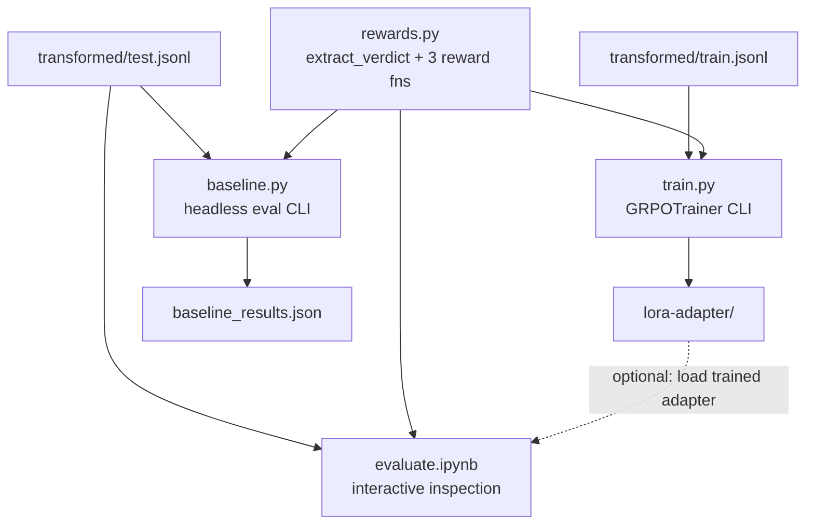

# GRPO Training Environment Plan

## Context

- Dataset: `transformed/train.jsonl` and `test.jsonl` (1208 train / 300 test records approx)
- Each `GRPORecord` has: `prompt` (user-only), `author`, `ground_truth_alignment`, `ground_truth_traits` (12 floats), `ground_truth_safety_score`, `length_scale` (`(turn_index+1)/total_turns`)
- System prompt injected at training time via `SYSTEM_PROMPT_TEMPLATE.format(author=...)` from `transform.py`

## Model Strategy (two-phase)

- **Phase 1 — prototype (default):** `unsloth/Llama-3.2-1B-Instruct-FP8-Block`
  - Fits on free Colab T4 (16 GB) with headroom; ~1 GB weights FP8
  - Use `max_seq_length=2048`, `num_generations=4`, `per_device_train_batch_size=4`
  - Goal: verify reward functions fire correctly, loss decreases, no OOM
- **Phase 2 — scale up:** `unsloth/Qwen3-8B-FP8` (pass `--model unsloth/Qwen3-8B-FP8`)
  - Requires Colab Pro L4 (22 GB) or RTX 3090/4090
  - Same script, same reward functions — no code changes needed

## New Files

### 1. `grpo-pipeline/src/grpo_pipeline/rewards.py`

Pure Python, no ML imports. Three reward functions matching TRL's `(prompts, completions, **kwargs) -> list[float]` signature. All kwargs are columns from the JSONL dataset passed through by `GRPOTrainer`.

**Format reward** — gates everything, not scaled by `length_scale`:

- `1.0` — both `<think>…</think>` and `<verdict>…</verdict>` present, JSON inside verdict parses and contains all 13 keys
- `0.5` — tags present but JSON is malformed/incomplete
- `0.0` — missing tags

**Alignment reward** — scaled by `length_scale`:

- Extract `alignment_status` from verdict JSON
- `+2.0 * length_scale` correct, `-1.0 * length_scale` wrong, `0.0` unparseable

**Trait MAE reward** — scaled by `length_scale`:

- Extract 12 trait floats from verdict JSON
- Weighted MAE: safety traits (manipulation, deception, exploitation) ×3, integrity ×2, logic ×1.5, empathy ×1
- `length_scale * (1.0 - weighted_mae)`, `0.0` if unparseable

Shared helper `extract_verdict(text: str) -> dict | None` is used by all three and also re-exported for `baseline.py`.

### 2. `grpo-pipeline/src/grpo_pipeline/train.py`

Follows the Unsloth FP8 GRPO notebook pattern closely (both Llama-3.2-1B and Qwen3-8B notebooks use the same structure).

**Key steps:**

1. Set `os.environ["UNSLOTH_VLLM_STANDBY"] = "1"` before any imports (enables sequential vLLM/train memory sharing — critical for T4)
2. `FastLanguageModel.from_pretrained("unsloth/Llama-3.2-1B-Instruct-FP8-Block", max_seq_length=2048, ...)` — model is a CLI arg, this is the default
3. Apply LoRA: `get_peft_model(r=32, target_modules=["q_proj","v_proj","k_proj","o_proj","gate_proj","up_proj","down_proj"])`
4. Load `train.jsonl` as HuggingFace `Dataset`, then map over it to prepend system prompt:

```python
def add_system_prompt(batch):
    return {"prompt": [
        [{"role": "system", "content": SYSTEM_PROMPT_TEMPLATE.format(author=a)}] + p
        for a, p in zip(batch["author"], batch["prompt"])
    ]}
dataset = dataset.map(add_system_prompt, batched=True)
```

1. `GRPOConfig`: `max_prompt_length`, `max_completion_length=768`, `num_generations=4`, `per_device_train_batch_size=4`, `learning_rate=5e-6`, `optim="adamw_8bit"`, `report_to="wandb"` (optional)
2. `GRPOTrainer(model, tokenizer, reward_funcs=[format_reward, alignment_reward, trait_reward], train_dataset=dataset, args=config)`
3. `trainer.train()` then save LoRA adapter to `--output-dir`

CLI args (via `typer`): `--train-file`, `--output-dir`, `--model` (default `unsloth/Llama-3.2-1B-Instruct-FP8-Block`), `--max-steps` (default 200), `--num-generations` (default 4), `--max-seq-length` (default 2048)

### 3. `grpo-pipeline/src/grpo_pipeline/baseline.py`

Headless CLI script — runs batch inference on `test.jsonl` and saves a JSON metrics report. Use this in automated evaluation (Colab without interactive kernel, CI).

**Steps:**

1. Load model (no LoRA, or with `--lora-adapter` path to evaluate a trained checkpoint)
2. For each record in `test.jsonl`: inject system prompt, apply chat template, run `model.generate()`
3. Extract verdict JSON with the shared `extract_verdict()` from `rewards.py`
4. Accumulate metrics:
  - Format success rate
  - Alignment accuracy overall + per-class confusion matrix
  - Safety trait MAE (manipulation / deception / exploitation)
  - All-trait MAE
  - Precision / recall for `misaligned` class (the most safety-critical)
5. Print table and save to `--output / baseline_results.json`

CLI args: `--test-file`, `--output`, `--model`, `--lora-adapter` (optional), `--max-new-tokens` (default 768), `--batch-size`

### 4. `grpo-pipeline/evaluate.ipynb`

Interactive notebook for human inspection — the notebook equivalent of `baseline.py` but designed for exploration and comparison. Lives at the `grpo-pipeline/` root (not under `src/`) so it can be opened directly in Colab.

**Sections:**

1. **Setup** — install Unsloth/vLLM, set model path + optional LoRA adapter path
2. **Load model** — same `FastLanguageModel.from_pretrained` pattern as `train.py`; a toggle cell to load LoRA adapter on top for post-training comparison
3. **Single-record inspection** — pick any record from `test.jsonl` by index, run inference, pretty-print the `<think>` reasoning and extracted verdict alongside the ground truth labels
4. **Batch metrics** — run over all test records, display metrics table (format rate, alignment accuracy, trait MAE, safety trait MAE, misaligned precision/recall)
5. **Side-by-side comparison** (optional section) — if two model paths are provided (base + LoRA), run both on the same 20 records and display a diff table showing where alignment verdicts changed

The notebook imports `extract_verdict` from `rewards.py` so parsing logic is not duplicated.

## `pyproject.toml` update

Add optional dependency group so the data pipeline stays installable without CUDA:

```toml
[project.optional-dependencies]
train = ["trl>=0.22", "torch>=2.0"]
```

`unsloth` and `vllm` are installed separately (platform-specific) via `pip install unsloth vllm` as in the Unsloth notebooks; they cannot be specified as regular `uv` packages because they require matching CUDA wheels.

A comment in the README will document the two-step install for training.

## Data Flow




## Reward Signal Summary


| Reward function  | Max value | Scaled by length_scale? | Purpose                   |
| ---------------- | --------- | ----------------------- | ------------------------- |
| format_reward    | 1.0       | No                      | Forces structured output  |
| alignment_reward | 2.0       | Yes                     | Correct alignment verdict |
| trait_reward     | ~1.0      | Yes                     | Accurate 12-trait scoring |


Max total reward at final turn: **4.0**. At turn 0 of a 5-turn thread (`length_scale=0.2`): **1.4**. This naturally discounts early-turn verdicts where the model has limited context.
