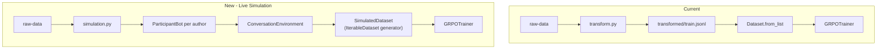

# Conversation Simulation Environment

## Architecture

The current training loop loads a static pre-transformed JSONL. The new architecture feeds GRPOTrainer a live streaming dataset that runs the conversation simulation on each iteration.




Each training step, GRPOTrainer pulls the next batch from `SimulatedDataset`, which continuously cycles through conversation threads — replaying them turn-by-turn — in shuffled order. The prompt format fed to the model is identical to the current format.

## New File: `[grpo-pipeline/src/grpo_pipeline/simulation.py](grpo-pipeline/src/grpo_pipeline/simulation.py)`

Three components:

`**ParticipantBot**` — abstract base wrapping a single author's messages, emitted chronologically. The same interface will back LLM-powered bots later.

```python
class ParticipantBot:
    author: str
    def next_message(self) -> ConversationRecord | None: ...
    def is_exhausted(self) -> bool: ...

class ReplayBot(ParticipantBot):
    """Replays historical ConversationRecord messages in order."""
```

`**ConversationEnvironment**` — manages one thread's state. Holds all messages pre-sorted by `created_at`; each `step()` pops the next one, appends it to the running context, and returns `(message, context_so_far)`.

```python
class ConversationEnvironment:
    def step(self) -> tuple[ConversationRecord, list[ConversationRecord]] | None: ...
    def run_to_records(self, min_context_turns: int) -> list[GRPORecord]: ...
```

`run_to_records` calls `transform.build_grpo_record` (already a pure function — no changes needed there) with a `min_context_turns` gate: records where `turn_index < min_context_turns` are skipped, and `length_scale` is recalculated over the filtered set.

`**SimulatedDataset**` — wraps the simulation as a HuggingFace `IterableDataset` suitable for direct use as `train_dataset` in `GRPOTrainer`.

```python
class SimulatedDataset:
    @staticmethod
    def generate(raw_data_dir: str, min_context_turns: int, seed: int):
        """Infinite generator: shuffles threads each epoch, yields GRPORecord dicts."""
        rng = random.Random(seed)
        while True:
            threads = load_all_conversation_threads(raw_data_dir)
            rng.shuffle(threads)
            for thread in threads:
                env = ConversationEnvironment(thread)
                for record in env.run_to_records(min_context_turns):
                    yield record.model_dump()

    @staticmethod
    def create(raw_data_dir, min_context_turns=0, seed=42) -> IterableDataset:
        return IterableDataset.from_generator(
            SimulatedDataset.generate,
            gen_kwargs={"raw_data_dir": raw_data_dir,
                        "min_context_turns": min_context_turns,
                        "seed": seed}
        )
```

Because the generator loops infinitely and yields `GRPORecord`-shaped dicts, GRPOTrainer receives the exact same column schema it currently reads from `train.jsonl`. The `format_prompts` map (which injects the system prompt and applies the chat template) is applied on top of this dataset unchanged.

## Changes to `[train.py](grpo-pipeline/src/grpo_pipeline/train.py)`

Add two new CLI flags:

- `--raw-data-dir PATH` — when set, use `SimulatedDataset.create()` instead of loading TRAIN_FILE
- `--min-context-turns N` (default `0`) — passed through to `SimulatedDataset.create()`

The data-loading block becomes:

```python
if args.raw_data_dir:
    from grpo_pipeline.simulation import SimulatedDataset
    raw_dataset = SimulatedDataset.create(args.raw_data_dir, args.min_context_turns)
    dataset = raw_dataset.map(format_prompts)          # streaming map
else:
    raw_records = [json.loads(l) for l in open(TRAIN_FILE) if l.strip()]
    dataset = Dataset.from_list(raw_records)
    dataset = dataset.map(format_prompts, batched=True)
```

Because `IterableDataset` has no length, `max_steps` must be set (already the case in all current configs).

## Changes to `[train.ipynb](grpo-pipeline/train.ipynb)`

Section 4 "Load & Prepare Training Data" gets a `USE_LIVE_SIM` toggle at the top:

```python
USE_LIVE_SIM       = True          # False = load from static train.jsonl (current behaviour)
RAW_DATA_DIR       = '../raw-data' # only used when USE_LIVE_SIM = True
MIN_CONTEXT_TURNS  = 1             # skip turn 0 of each thread (no prior context)
```

The two loading paths (static vs simulated) are clearly delimited under the toggle so users can see exactly what changes.

## Minimum Context Gate

The `min_context_turns` parameter gates out early turns that carry noisy signal (discussed in prior analysis):

- `0` — identical to current behaviour, all turns included
- `1` — drop the first message in every thread (oversight agent always has at least 1 prior message)
- `2` — require at least 2 prior messages before emitting a training record

`length_scale` is recalculated over the filtered turn set so the reward scaling stays consistent.

## What `transform.py` Becomes

`transform.py` is no longer in the hot path for training. It remains useful for:

- Generating a static `test.jsonl` for evaluation (used by `evaluate.ipynb`)
- Offline inspection of the dataset distribution
- `split.py` still operates on its output for evaluation splits

No changes needed to `transform.py` for this plan.

## Future Extension: LLM-Powered Bots

The `ParticipantBot` abstract base class is designed so an `LLMParticipantBot` can be added later:

- Calls an LLM API to generate the next utterance given thread context + author persona
- A companion oracle evaluator (e.g. Claude API) generates the ground-truth label for the synthetic message
- The `ConversationEnvironment` and `SimulatedDataset` require no changes — they just call `bot.next_message()`

## Files Touched

- `grpo-pipeline/src/grpo_pipeline/simulation.py` — new file
- `grpo-pipeline/src/grpo_pipeline/train.py` — add `--raw-data-dir` and `--min-context-turns`
- `grpo-pipeline/train.ipynb` — add `USE_LIVE_SIM` toggle to Section 4
- `grpo-pipeline/README.md` — document live simulation mode
- No changes to `rewards.py`, `models.py`, `split.py`, or `transform.py`
